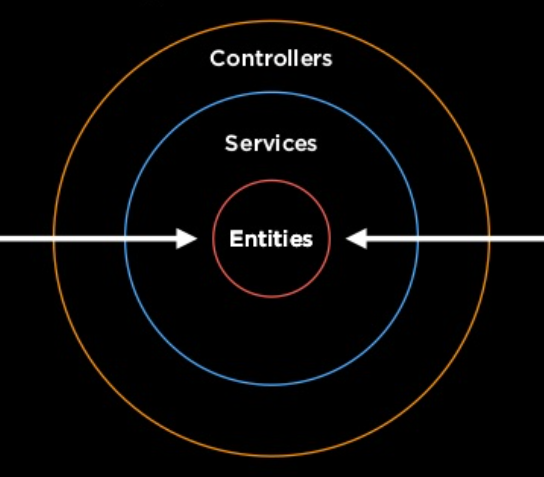

---
# try also 'default' to start simple
theme: seriph
# random image from a curated Unsplash collection by Anthony
# like them? see https://unsplash.com/collections/94734566/slidev
background: https://d33wubrfki0l68.cloudfront.net/b48d3f70dffd76bf3152ad04e2cbb1261ef589c9/header.1af6756a.png
# apply any windi css classes to the current slide
class: 'text-center'
# https://sli.dev/custom/highlighters.html
highlighter: shiki
# some information about the slides, markdown enabled
info: |
  ## Slidev Starter Template
  Presentation slides for developers.

  Learn more at [Sli.dev](https://sli.dev)
---

# Hello, Nest

A progressive Node.js framework for building efficient, reliable and scalable server-side applications.

<div class="pt-12">
  <span @click="$slidev.nav.next" class="px-2 p-1 rounded cursor-pointer" hover="bg-white bg-opacity-10">
    Let's Go <carbon:arrow-right class="inline"/>
  </span>
</div>


<a href="https://nestjs.com" target="_blank" alt="Nest Js"
  class="doc-btn m-6 text-xl icon-btn opacity-50 !border-none !hover:text-white">
  
</a>
<a href="https://github.com/nestjs/nest" target="_blank" alt="GitHub"
  class="abs-br m-6 text-xl icon-btn opacity-50 !border-none !hover:text-white">
  <carbon-logo-github />
</a>

<style>
h1 {
  color: #ea2845 !important;
}

.logo {
  width: 25px;
}
.doc-btn {
    position: absolute;
    bottom: 0px;
    right: 50px;
}
</style>
<!--
The last comment block of each slide will be treated as slide notes. It will be visible and editable in Presenter Mode along with the slide. [Read more in the docs](https://sli.dev/guide/syntax.html#notes)
-->

---

# What is NestJS?

Nest (NestJS) is a framework for building efficient, scalable Node.js server-side applications.

-  **Controllers** - handle incoming requests and returning responses to the client
-  **Providers** - services, repositories, factories, helpers, and so on
-  **Modules** 
-  **Middleware** - function which is called before the route handler
-  **Exception filters** - process all unhandled exceptions across an application
-  **Pipes** - transformation, validation
-  **Guards** - determine whether a given request will be handled by the route handler or not
-  **Interceptors** - determine whether a given request will be handled by the route handler or not

<br>
<br>

Next

<!--
You can have `style` tag in markdown to override the style for the current page.
Learn more: https://sli.dev/guide/syntax#embedded-styles
-->

<style>
h1 {
  background-color: #2B90B6;
  background-image: linear-gradient(45deg, #4EC5D4 10%, #146b8c 20%);
  background-size: 100%;
  -webkit-background-clip: text;
  -moz-background-clip: text;
  -webkit-text-fill-color: transparent; 
  -moz-text-fill-color: transparent;
}
</style>

---


# Controllers

[learn more](https://docs.nestjs.com/controllers)

<div grid="~ cols-1">
<div>

</div>
</div>


<style>
img {
  width: 900px;
}
</style>

---


# Controllers

```ts
@Controller('cats')
export class CatsController {
  @Post('login')
  @HttpCode(HttpStatus.OK)
  @ApiOkResponse({
    status: HttpStatus.OK,
    type: LoginPayloadDto,
    description: 'User info with access token',
  })
  async userLogin(
    @Body() userLoginDto: UserLoginDto,
  ): Promise<LoginPayloadDto> {
    const user = await this._authService.validateUser(userLoginDto);
    const token = await this._authService.createToken(user);

    return new LoginPayloadDto(user.toDto(), token);
  }
}
```

---


# Controllers

|     |     |
| --- | --- |
|@Request(), @Req() | req|
|@Response(), @Res()* | res|
|@Next()| next|
|@Session() | req.session|
|@Param(key?: string) | req.params / req.params[key]|
|@Body(key?: string) |req.body / req.body[key]|
|@Query(key?: string) | req.query / req.query[key]|
|@Headers(name?: string) |req.headers / req.headers[name]|
|@Ip()| req.ip|
|@HostParam()||


---

# Providers

Plain Injectable classes [learn more](https://docs.nestjs.com/providers)
<div grid="~ cols-2 gap-4">
<div>

services, repositories, factories, helpers, and so on

</div>
<div>


</div>
</div>

---

# Providers
<div grid="~ cols-2 gap-4">
<div>

```ts
@Injectable()
export class CatsService {
}
```

</div>
<div>



</div>
</div>

---


# Module


<style>
img {
  width: 900px;
}
</style>

---


# Module


<style>
img {
  width: 900px;
}
</style>

---


# Module

|     |     |
| --- | --- |
|providers| the providers that will be instantiated by the Nest injector and that may be shared at least across this module
|controllers| the set of controllers defined in this module which have to be instantiated
|imports| the list of imported modules that export the providers which are required in this module
|exports| the subset of providers that are provided by this module and should be available in other modules which import this module

---


# Middlewares


* execute any code.
* make changes to the request and the response objects.
* end the request-response cycle.
* call the next middleware function in the stack. if the current middleware function does not end the request-response cycle, it must call next() to pass control to the next middleware function

<style>
img {
  width: 900px;
}
</style>

---

# Middlewares
Declare
```ts
@Injectable()
export class LoggerMiddleware implements NestMiddleware {
  use(req: Request, res: Response, next: NextFunction) {
    console.log('Request...');
    next();
  }
}
```
Usages
```ts
export class AppModule implements NestModule {
  configure(consumer: MiddlewareConsumer) {
    consumer
      .apply(LoggerMiddleware)
      .forRoutes(CatsController);
  }
}
```
```ts
const app = await NestFactory.create(AppModule);
app.use(logger);
await app.listen(3000);
```

---

# Exception filters


<style>
img {
  width: 900px;
}
</style>
---

# Exception filters


<style>
img {
  width: 900px;
}
</style>
---


# Pipes


<style>
img {
  width: 900px;
}
</style>
---


# Guards

```ts
@Injectable()
export class AuthGuard implements CanActivate {
  canActivate(
    context: ExecutionContext,
  ): boolean | Promise<boolean> | Observable<boolean> {
    const request = context.switchToHttp().getRequest();
    return validateRequest(request);
  }
}
```
Usage
```ts
@UseGuards(RolesGuard)
export class CatsController {

}

// global
const app = await NestFactory.create(AppModule);
app.useGlobalGuards(new RolesGuard());
```
---


# Interceptors


- bind extra logic before / after method execution
- transform the result returned from a function
- transform the exception thrown from a function
- extend the basic function behavior
- completely override a function depending on specific conditions (e.g., for caching purposes)

<style>
img {
  height: 280px;
}
</style>

---

# Interceptors

```ts
@Injectable()
export class LoggingInterceptor implements NestInterceptor {
  intercept(context: ExecutionContext, next: CallHandler): Observable<any> {
    console.log('Before...');

    const now = Date.now();
    return next
      .handle()
      .pipe(
        tap(() => console.log(`After... ${Date.now() - now}ms`)),
      );
  }
}
// Binding interceptors
@UseInterceptors(LoggingInterceptor)
export class CatsController {}

const app = await NestFactory.create(AppModule);
app.useGlobalInterceptors(new LoggingInterceptor());
```
---
class: px-20
---

# Interceptors

```ts
// JSONAPI

export interface Response<T> {
  data: T;
}

@Injectable()
export class TransformInterceptor<T> implements NestInterceptor<T, Response<T>> {
  intercept(context: ExecutionContext, next: CallHandler): Observable<Response<T>> {
    return next.handle().pipe(map(data => ({ data })));
  }
}
```
---
class: px-20
---

# Themes

Slidev comes with powerful theming support. Themes can provide styles, layouts, components, or even configurations for tools. Switching between themes by just **one edit** in your frontmatter:

<div grid="~ cols-2 gap-2" m="-t-2">

```yaml
---
theme: default
---
```

```yaml
---
theme: seriph
---
```


</div>

Read more about [How to use a theme](https://sli.dev/themes/use.html) and
check out the [Awesome Themes Gallery](https://sli.dev/themes/gallery.html).

---
preload: false
---

# Learn More

[Documentations](https://docs.nestjs.com/) / [Example - Github](https://github.com/nestjs/nest)
